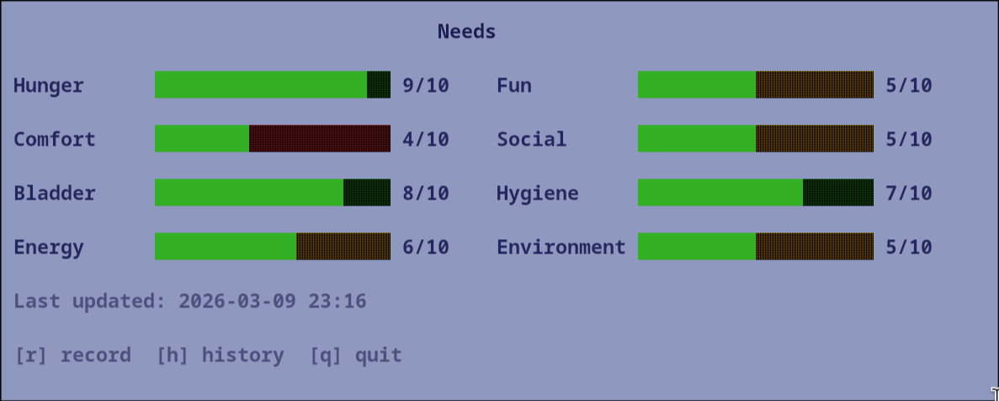
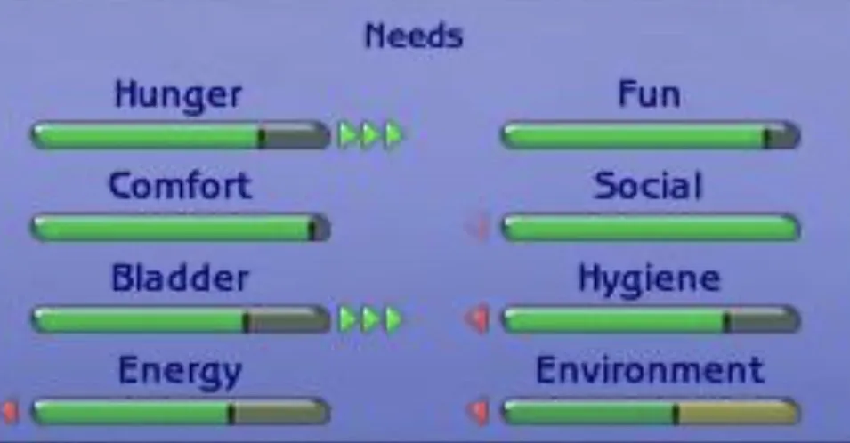

# sbars

[](https://github.com/maxh213/sbars/actions/workflows/test.yml)
[](https://aur.archlinux.org/packages/sbars)
[](https://go.dev)
[](https://opensource.org/licenses/MIT)

A Sims-style needs tracker for your terminal. Track 8 life needs (Hunger, Comfort, Bladder, Energy, Fun, Social, Hygiene, Environment) with a TUI inspired by The Sims 1. For those of us who forget to take care of themselves but are pretty good at taking care of a virtual sim. It's mainly to be used as a reminder to check in with your own sims bars throughout the day.

Btw this is vibe coded cause it's a very small and quick project which should only be run locally and the only thing it does is save json to your machine for history. 



Inspired by the original Sims 1 needs panel:



## Install

### Arch Linux (AUR)

```bash
paru -S sbars
# or
yay -S sbars
```

### From source

```bash
git clone https://github.com/maxh213/sbars.git
cd sbars
go build -o sbars
```

## Usage

```bash
./sbars
```

### Flags

| Flag | Description |
|------|-------------|
| `--no-trends` | Hide trend arrows |

### Controls

| Key | Action |
|-----|--------|
| `r` | Record new need values (1-10 for each) |
| `h` | View history of past entries |
| `q` | Quit |

### Trend arrows

After each bar, Sims-style trend arrows show how each need changed since your last entry. Green `▶` arrows indicate improvement, red `◀` arrows indicate decline. The number of arrows (1-3) reflects the magnitude of the change.

### Input mode

When recording, enter a value from 1-10 for each need. Press `Enter` to confirm each value, or `Escape` to cancel.

### History mode

View past entries in a table. Use `Up`/`Down` or `j`/`k` to scroll.

### Automatic prompts

sbars will automatically prompt you to record your needs if an hour has passed since your last entry.

## Data

Entries are saved as JSON to `~/.local/share/sbars/history.json` (respects `$XDG_DATA_HOME`).

## Stack

- [Bubble Tea](https://github.com/charmbracelet/bubbletea) - TUI framework
- [Lip Gloss](https://github.com/charmbracelet/lipgloss) - Styling

## Tests

```bash
go test ./... -v -cover
```
